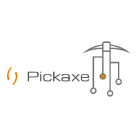
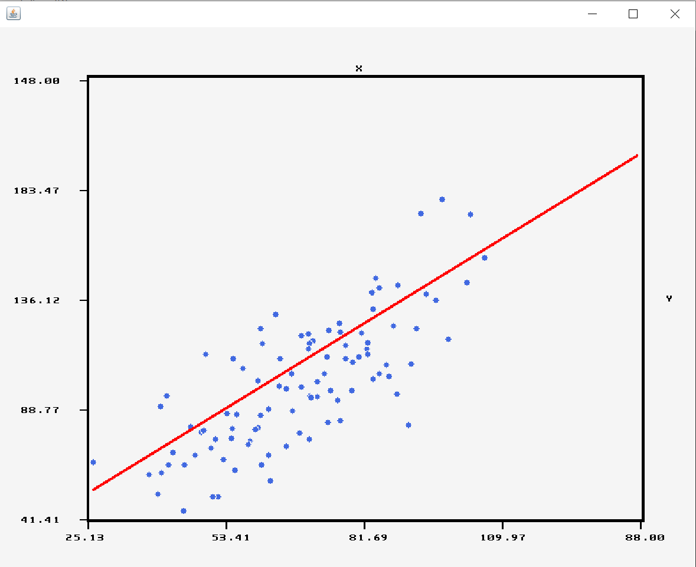
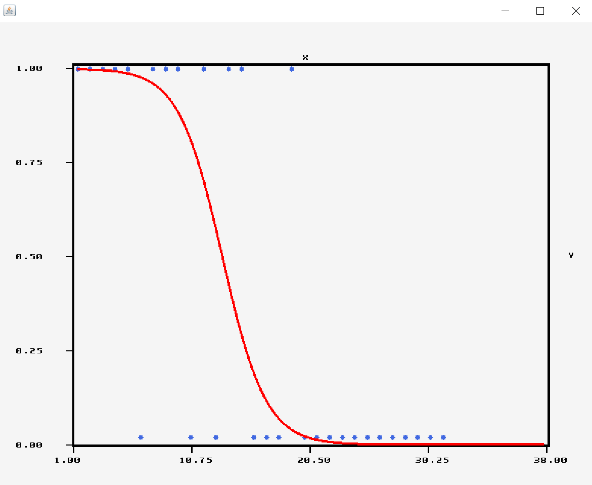
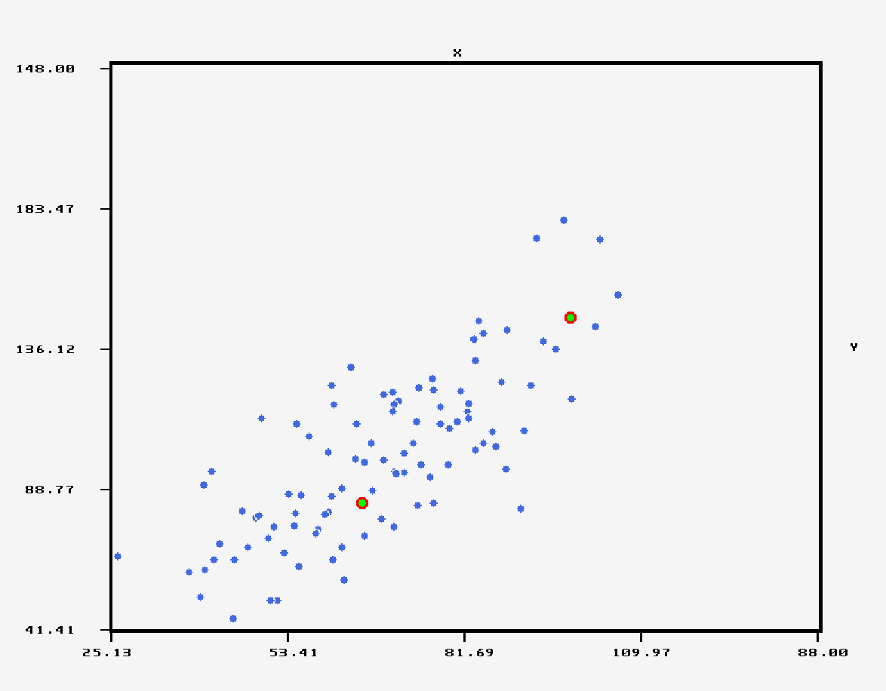
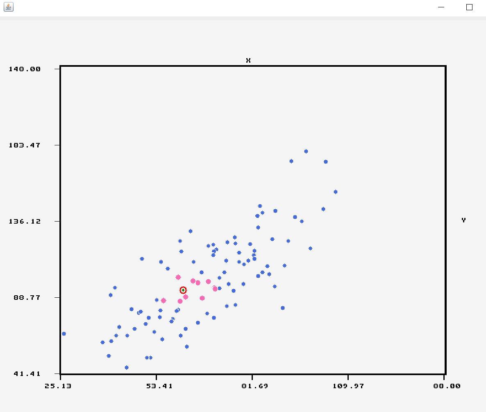

# Cpp_Pickaxe

[![Stargazers][stars-shield]][stars-url]
[![Commits][commits-shield]][commits-url]
[![Issues][issues-shield]][issues-url]
[![MIT License][license-shield]][license-url]
[![LinkedIn][linkedin-shield]][linkedin-url]

<!-- PROJECT LOGO -->
 

  

  <h3 align="center">Pickaxe Library</h3>

  

    Simple Solution For Fast Programming Of Data Mining ,Deep Learning And Machine Learning Models As Well As CSV Management.
     
    <a href="https://github.com/MuteJester/Cpp_Pickaxe/wiki"><strong>Explore the docs »</strong></a>
     
     
    <a href="https://github.com/MuteJester/Cpp_Pickaxe/wiki/">View Demo</a>
    ·
    <a href="https://github.com/MuteJester/Cpp_Pickaxe/issues">Report Bug</a>
    ·
    <a href="https://github.com/MuteJester/Cpp_Pickaxe/issues">Request Feature</a>
  

<!-- TABLE OF CONTENTS -->
## Table of Contents

* [About the Project](#about-the-project)
* [Usage](#usage)
* [Roadmap](#roadmap)
* [Contributing](#contributing)
* [License](#license)
* [Contact](#contact)

<!-- ABOUT THE PROJECT -->
## About The Project
There are a few Deep Learning And Machine Learning C++ libraries out there, but none of them in my mind were simple enough to use and required the user to install loads of additional dll's and waste a lot of time of linking all the parts together.
At that moment the idea is to create a simple plug and play C++ header file which can be simply dragged into the folder of any project and functionality of all the tools that the Pickaxe library can be quickly and easily accessed and used.

Here's Why Pickaxe :
* It's As Simple As Drag And Drop and you are ready to code!
* Function and methods are named meaningful names that way it is always clear what are the parameters or what does the method do!
* CSV handling is all included in the library working with them made much easier trough java code!
* Developing complex matrix algorithms ? we've got you covered with a dynamic Matrix class filled with quick usful methods strating from eigen value/vector extraction trough basic operations up to decompositions.
### Built With
* [Visual Studio](https://www.eclipse.org/)
* [SIPL Image Proccesing Library](https://github.com/MuteJester/Simple_Image_Processing_Library)

### Installation
1. Download All Headerfiles From The Repository [Go To Repository Folder](https://github.com/MuteJester/Cpp_Pickaxe/tree/master/Pickaxe_CPP)
2. Copy Headerfiles Into Your Projects Folder
3. Include "CPP_Pickaxe.h" and "CPP_Sipl.h" (for image processing and visual elements like plots)
4. You Are Ready To Code!

<!-- USAGE EXAMPLES -->
## Usage

#### Ploting Linear Regression Algorithm

Pickaxe Offers Binary Linear Regression As Well As Multivariable Linear Regression
in the following exmaple a fast method for immediate ploting of a linear regression model.

#### Ploting Logistic Regression Algorithm

Pickaxe Offers Binary Logistic Regression As Well As Multivariable Logistic Regression
in the following example a fast method for immediate plotting of a logistic regression model.
the logistic regression functionality, as well as the linear regression, can be used as pleased
the methods return the weights resulting after computing the optimal state using gradient descent;

#### Ploting 2D K-Means Algorithm

Pickaxe Offers a fast and efficenet K-means calculation aglorithm although currently only up to 3 dimensional K - Means
calculations supported soon there will a higher dimension support system.

#### Ploting 2D K-Nearest-Neighbors Algorithm

Pickaxe Offers a simple and dynamic kNN implementation aglorithm for all your use case as well as a quick
plot method for immediate display of 2D kNN results. 
In the above image- the red ciricle with the green dot in the center is the new added value, blue points that turned pink are the specified K nearest neighbors.

#### Ploting User Designed Fully Connected Neural Network Topology

Pickaxe Offers you a method which is a part of the Neural_Net class which allows you to visualize you neural network topology inorder for you to validate that the topology you have specified in the Neural_Net class constructor is indeed the topology created and set.  

### Currently Supported Data Mining / Machine Learning / Deep Learning, Algorithms
  * __Linear Regression using Static Formula (Only supported for single variable linear regression)__
  * __Linear Regression using Gradient Descent (Multivariable regression supported using matrix with Lasso Regression and L1 Regularization)__
  * __Logistic Regression of binary variable as well as multivariable equations__
  * __Validation Of Logistic Regression - Confusion Matrix__
  * __K-Means calculation (up to 3-dimensional data variables)__
  * __kNN - k Nearest Neighbors__
  * __Fully Connected Neural Network Constructor class accepting all forms of network topologies for dynamic use__
  * __Q Learning "Custom-fit" Class applicable for any use__
  * __Error computations such as MSE,MAE,MPE__
  * __Correlation computations such as R^2, Adj-R^2, Pearsons,Spearman -__
  * __Confusion Matrix Construction For A Given Model Weights__
  * __Some of the models have supported validation methods which will automatically compare machine guesses against actual values__
  * __Principal Component Analysis__
  * __Corpus And Bag Of Words Containers__
  * __Sentiment Analysis (Vader Algorithm)__
  
  ### Currently Supported CSV Handling Functionality
  
  * __Reading/Writing CSV Files__
  * __CSV Importation From Web URL's__
  * __Column Classification (Numeric/Categorical/Date-Time/Text)__
  * __Single Block/Column/Row Manipulations__
  * __Removal and Addition of columns and rows__
  * __Pattern Replacment__
  * __Pulling and pushing values into csv stated position__
  * __CSV spliting by percentage into seperate data sets__
  * __Column Statistical Calculations such as - Column Standard Deviation and Column Variance/Covariance,Column Correlation..__
  * __Column Missing Value Reduction / Replacement__
  
  
  
  ### All Visual Elements Are Created Using The SIPL Library
  
 

_For more Detailed Instructions, please refer to the [User Instructions](https://github.com/MuteJester/Java_Brain/wiki/User-Manual)_

<!-- ROADMAP -->
## Roadmap

See the [open issues](https://github.com/MuteJester/Java_Brain/issues) for a list of proposed features (and known issues).

<!-- CONTRIBUTING -->
## Contributing

Contributions are what make the open-source community such a powerful place to create new ideas, inspire, and make progress. Any contributions you make are **greatly appreciated**.

1. Fork the Project
2. Create your Feature Branch (`git checkout -b feature/AmazingFeature`)
3. Commit your changes (`git commit -m 'Add some AmazingFeature'`)
4. Push to the Branch (`git push origin feature/AmazingFeature`)
5. Open a Pull Request

<!-- LICENSE -->
## License

Distributed under the MIT License. See `LICENSE` for more information.

<!-- CONTACT -->
## Contact

[Thomas Konstantinovsky]() - thomaskon90@gmail.com

Project Link: [https://github.com/MuteJester/Cpp_Pickaxe](https://github.com/MuteJester/Cpp_Pickaxe)

<!-- MARKDOWN LINKS & IMAGES -->
[stars-shield]: https://img.shields.io/github/stars/MuteJester/Cpp_Pickaxe.svg?style=flat-square
[stars-url]: https://github.com/MuteJester/Cpp_Pickaxe/stargazers
[issues-shield]: https://img.shields.io/github/issues/othneildrew/Best-README-Template.svg?style=flat-square
[issues-url]: https://github.com/MuteJester/Cpp_Pickaxe/issues
[license-shield]: https://img.shields.io/github/license/othneildrew/Best-README-Template.svg?style=flat-square
[license-url]: https://github.com/MuteJester/Cpp_Pickaxe/blob/master/LICENSE
[commits-shield]: https://img.shields.io/github/commit-activity/m/MuteJester/Cpp_Pickaxe?style=flat-square
[commits-url]: https://github.com/MuteJester/Cpp_Pickaxe
[linkedin-shield]: https://img.shields.io/badge/-LinkedIn-black.svg?style=flat-square&logo=linkedin&colorB=555
[linkedin-url]: https://www.linkedin.com/in/thomas-konstantinovsky-56230117b/
